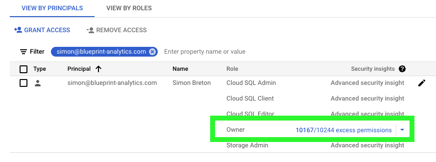
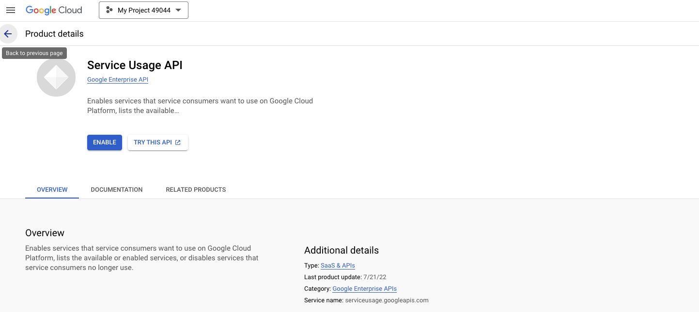
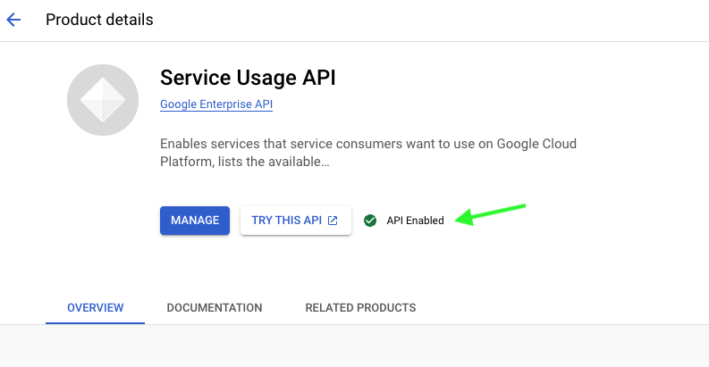
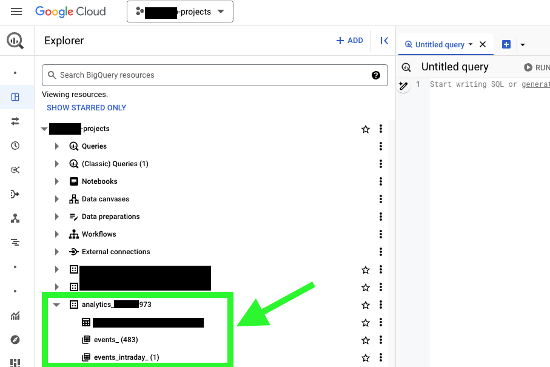

This guide provides detailed instructions for configuring Google Cloud Platform (GCP) to ensure a seamless setup for the GA4Dataform installer. It is primarily designed for beginners, while advanced users should find it straightforward to meet the requirements outlined in the introduction without needing additional guidance.

## Introduction

GA4Dataform is a set of SQL models and JavaScripts designed to run within Dataform. It doesn’t require a dedicated installation process—connecting our repository with a Dataform repository is all it takes to "deploy" GA4Dataform.

However, to assist less technical users and save time for advanced users, we’ve developed an installer. This installer simplifies the entire Dataform deployment and configuration process, including setting up repositories, workspaces, schedulers, and more.

For the installer to work effectively, it requires certain permissions within a Google Cloud Project (GCP) and must meet specific prerequisites.

This guide will walk you through the key steps to prepare before running GA4Dataform installer:

- Checking access permissions.
- Enabling the Service Usage API.
- Verifying your GA4 BigQuery export.
- Confirming your billing status.

Each of these steps is detailed in the sections below.

## Check Access Permissions

Ensure that your account has the necessary permissions to run our installer.

1. Open the [**IAM & Admin** page](https://console.cloud.google.com/iam-admin).
2. Use the email filter to quickly locate your account.
3. Verify that your account has one of the following roles:
   - `roles/owner`
   - `roles/editor`
   - `roles/serviceusage.admin`

Example of account with owner access

If your account lacks the required permissions, contact your GCP administrator to request access or reach us at 
support@ga4dataform.com for assistance.

## Check Billing Status

Ensure that your project has an active billing account.

1. Navigate to the [**Billing** page](https://console.cloud.google.com/billing).
2. Verify that you can access the billing overview page. If so, your billing account is active.
3. If you see a message stating “This project has no billing account,” you need to activate your billing account. Check the [**official google documentation**](https://cloud.google.com/billing/docs/how-to/modify-project.)

An active billing account is essential for BigQuery exports and other paid GCP services.

:::warning BigQuery Cost
Creating a billing account won't directly generate any cost. However, using GA4Dataform will generate BigQuery costs, so please keep an eye on your Billing. We're not responsible for any charges that may come up.
:::

## Enable the Service Usage API

Activate the **Service Usage API** to enable the GA4Dataform installer to function properly.

1. Open the [**Service Usage API page**](https://console.cloud.google.com/marketplace/product/google/serviceusage.googleapis.com).
2. Check if the API is enabled. If not, click the **Enable** button (typically blue and located near the top of the page).
3. Wait for the confirmation message indicating the API has been successfully enabled. Once activated, the button will change to **Disable** to indicate the API is enabled.

**Before**

**After**

## Verify GA4 BigQuery Export Setup

Ensure that your GA4 property is properly linked to BigQuery.

1. Navigate to [**BigQuery**](https://console.cloud.google.com/bigquery) from the GCP menu.
2. Look for a dataset named after your GA4 property.
3. Confirm that the dataset contains tables such as `events_YYYYMMDD`.

If the dataset or tables are missing, revisit the GA4 interface to ensure the BigQuery linking is correctly configured.

## Conclusion

Once you have validated all these steps, you're ready to run the GA4Dataform installer.

For further assistance, feel free to reach us at support@ga4dataform.com.
