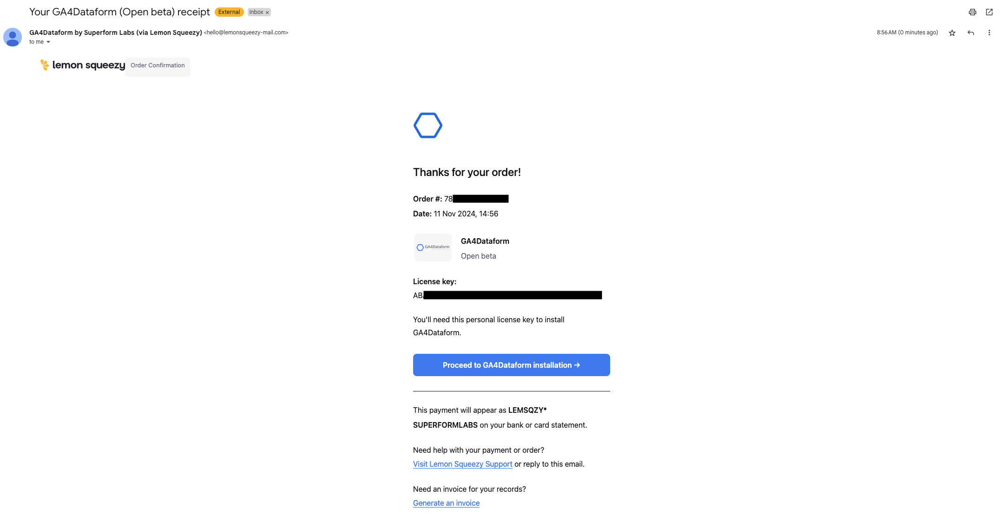
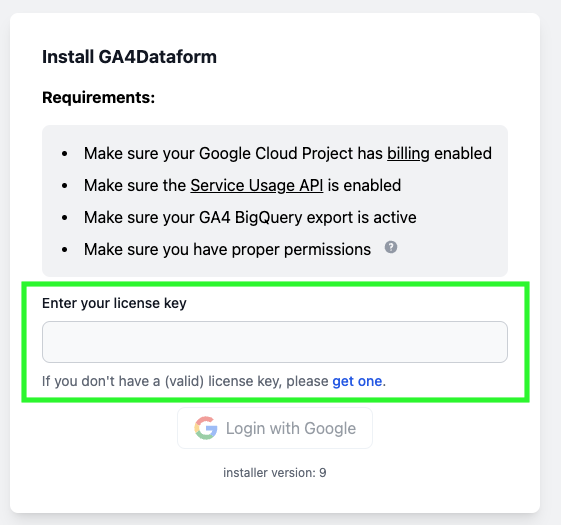
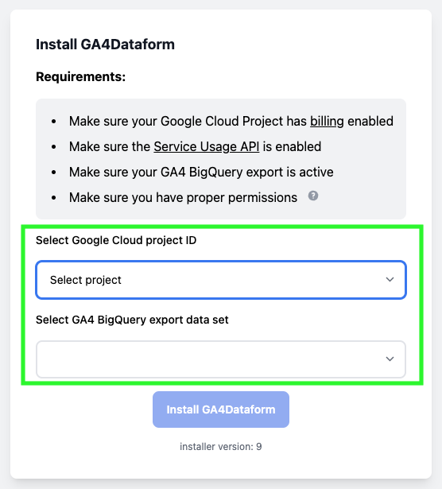
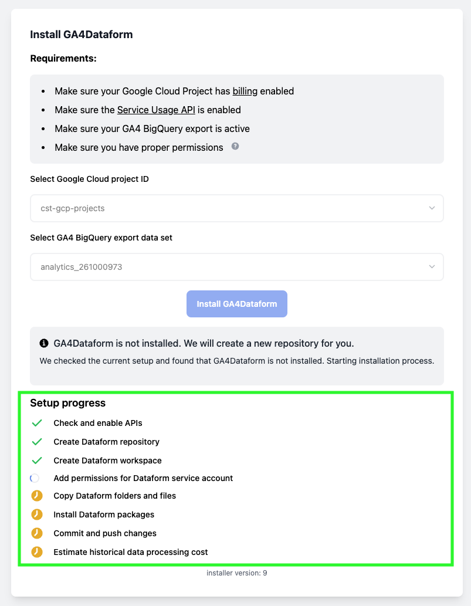
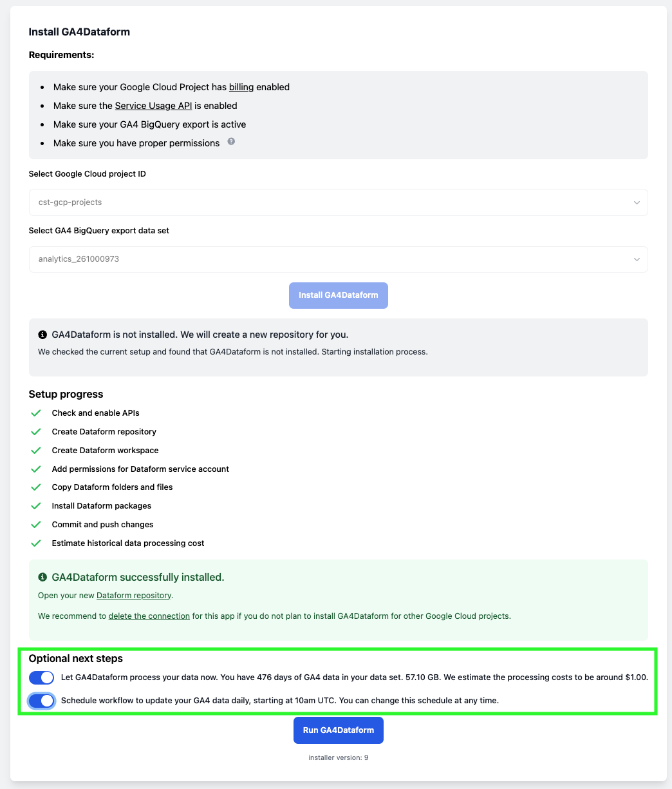
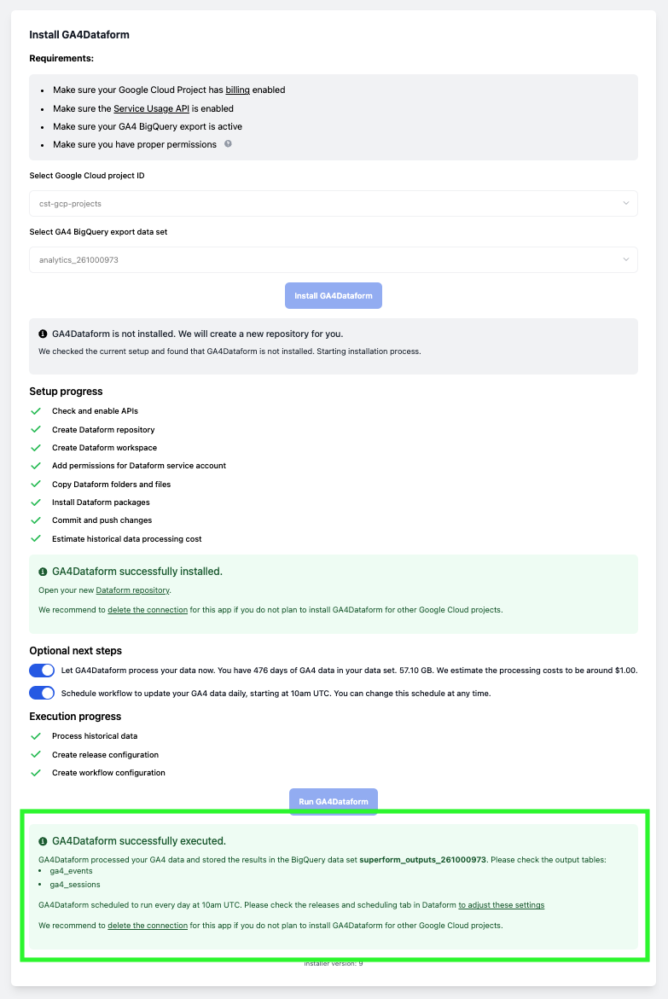
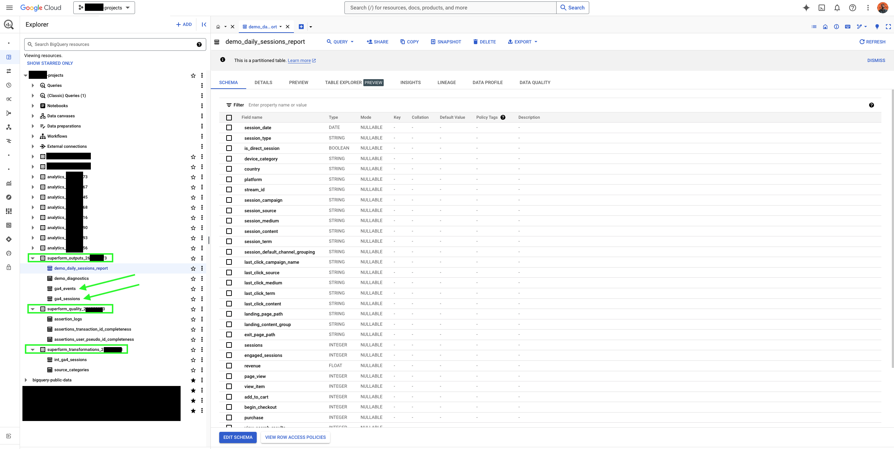
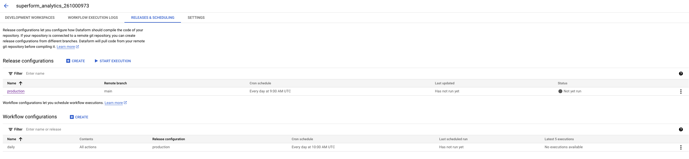

--- 

## Walkthrough video

<iframe width="560" height="315" src="https://www.youtube.com/embed/KmtdmlExIZM?si=WUbJplbV-tLHVOJU" title="YouTube video player" frameborder="0" allow="accelerometer; autoplay; clipboard-write; encrypted-media; gyroscope; picture-in-picture; web-share" referrerpolicy="strict-origin-when-cross-origin" allowfullscreen></iframe>

---

## Text Guide

### Activate Your License Key

1. **Get your License Key**: After requesting access to [GA4Dataform](https://ga4dataform.com/), you will receive a confirmation email from Lemon Squeezy with your license key and a link to the installer. Save the license key, and click "Proceed to GA4Dataform installation".

   

2. **Enter License Key**: In the GA4Dataform installer, enter your license key in the provided field and click "Login with Google" to continue.

   

:::warning Google Cloud Platform Configuration
Ensure that your Google Cloud Project meets the setup requirements (billing enabled, Service Usage API enabled, GA4 BigQuery export active, and proper permissions).
:::

---

### Install GA4Dataform

1. **Select Project and Data Set**: The installer will automatically list all Google Cloud Platform projects you have access to and, within each project, all available GA4 BigQuery export tables. Choose your Google Cloud project and GA4 BigQuery export table from the dropdown menus, then click "Install GA4Dataform".

   

:::tip Multiple GA4 BigQuery Exports
If you have multiple BigQuery export projects, ensure you select the correct one. If you want to run GA4Dataform for each BigQuery Export you will have to run a different installation for each one of them. 
:::

2. **Installation Progress**: After clicking "Install GA4Dataform", the installer will display each setup step, such as checking APIs, creating the Dataform repository, and configuring permissions. Wait for each step to complete.

   

---

### Configure and Run GA4Dataform

Once the installation is complete, you'll see a success message and two optional next steps, shown as toggle buttons:
- The first option allows GA4Dataform to process your entire GA4 historical data set. It provides an estimate of the associated cost.
- The second option enables GA4Dataform to create a Dataform schedule to process your GA4 data daily.

Toggle on both options, then click "un GA4Dataform".

   

:::warning BigQuery Cost
Using GA4Dataform will incur BigQuery costs, so please monitor your billing. We're not responsible for any charges that may arise.
:::

:::tip Customization
Once installed, GA4Dataform is fully customizable. You can adjust the schedule workflow and modify variables to process your GA4 data differently (e.g., filtering by domains, events, etc.).
:::

---

### You're Done!

GA4Dataform is now fully installed and operational. Here’s a summary of what we have accomplished:
1. Active your GA4Dataform licence key.
2. Selected a Google Cloud project and GA4 BigQuery export data set.
3. Ran the Dataform installation package.
4. Configured Dataform workflow scheduling and processed GA4 historical data.

   

---

### Check Configuration and Output

1. **Data Output**: Processed GA4 data will appear directly in BigQuery in tables such as `ga4_events` and `ga4_sessions`.

   

2. **Execution Logs and Scheduling**: After setup, you can check the **Releases & Scheduling** tab in your Dataform workspace to view or adjust the release and workflow schedules.

   

